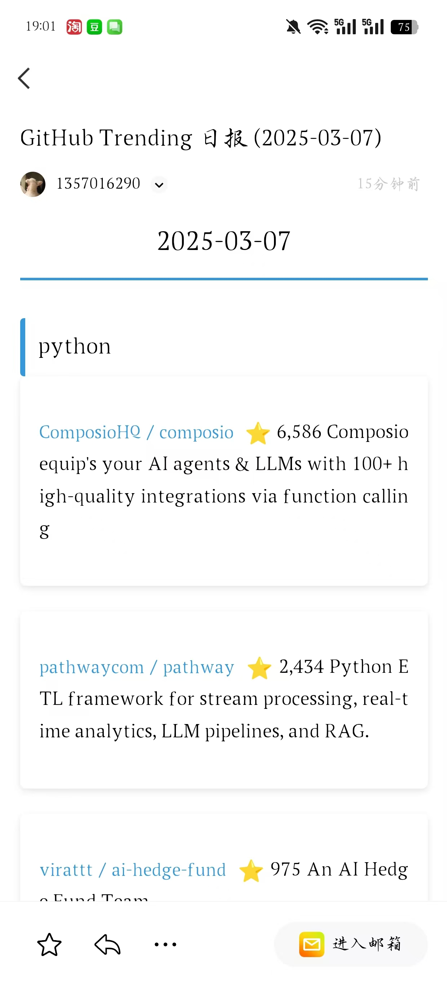

# GitHub Trending 项目抓取工具

帮我整理github最新有趣的项目的小助手，可以爬取github的trending项目，并保存到本地，上传到git仓库。

## 功能特点

- 支持多种编程语言的Trending项目抓取
- 自动生成Markdown或CSV格式的报告
- 可配置自动提交到Git仓库
- 支持代理设置，解决网络访问问题
- 可自定义每种语言抓取的仓库数量
- 可自定义抓取的日期
- 可以自动发送邮件到指定邮箱




## 安装说明

1. 克隆本仓库到本地
```bash
git clone https://github.com/yourusername/TrendingGet.git
cd TrendingGet
```

2. 安装依赖包
```bash
pip install -r requirements.txt
```

## 配置说明

项目使用 `config.json` 文件进行配置，支持以下选项：

```json
{
  "languages": [
    "python",
    "javascript",
    "go",
    "java",
    "rust"
  ],
  "auto_push": true,
  "update_frequency": "daily",
  "max_repos_per_language": 10,
  "file_format": "markdown",
  "proxy": {
    "http": "http://127.0.0.1:7890",
    "https": "http://127.0.0.1:7890"
  }
}
```

API 密钥和其他敏感信息请在 `secret.py` 文件中配置，示例文件 `secret_example.py` 已提供。


### 配置项说明

- `languages`: 要抓取的编程语言列表，可以添加或删除语言
- `auto_push`: 是否自动提交并推送到Git仓库
- `update_frequency`: 更新频率（目前仅支持daily）
- `max_repos_per_language`: 每种语言最多抓取的仓库数量
- `file_format`: 输出文件格式（目前仅支持markdown）
- `proxy`: 代理设置，如果你需要通过代理访问GitHub

## 使用方法

1. 编辑 `config.json` 文件，设置你想要抓取的编程语言和其他配置项
2. 运行主程序抓取trending项目
```bash
python get_trending_repos.py
```

## 定时任务设置

### Windows任务计划程序设置（每天23:00自动运行）

1. 按下 `Win + R` 组合键，输入 `taskschd.msc` 并回车，打开任务计划程序
2. 在右侧操作面板中点击 `创建基本任务`
3. 输入任务名称（如 `GitHub Trending 抓取`）和描述，点击 `下一步`
4. 选择 `每天`，点击 `下一步`
5. 设置开始日期和时间为 `23:00:00`，点击 `下一步`
6. 选择 `启动程序`，点击 `下一步`
7. 在 `程序或脚本` 框中输入 `python` 的完整路径（如 `C:\Python39\python.exe`）
8. 在 `添加参数` 框中输入脚本的相对路径（如 `get_trending_repos.py`）
9. 在 `起始于` 框中输入项目的完整路径（如 `D:\code\TrendingGet`）
10. 点击 `下一步`，然后点击 `完成`

如果需要更高级的设置，可以在创建任务后右键点击任务，选择 `属性`：
- 在 `常规` 选项卡中，可以选择 `不管用户是否登录都要运行` 和 `使用最高权限运行`
- 在 `条件` 选项卡中，可以取消勾选 `只有在计算机使用交流电源时才启动此任务`
- 在 `设置` 选项卡中，可以选择 `如果错过运行计划开始时间，立即启动任务`

### Linux/Mac (使用crontab)
```bash
# 每天23:00运行
0 23 * * * cd /path/to/TrendingGet && python get_trending_repos.py
```

## 贡献指南

欢迎提交Pull Request或Issue来改进这个项目！

